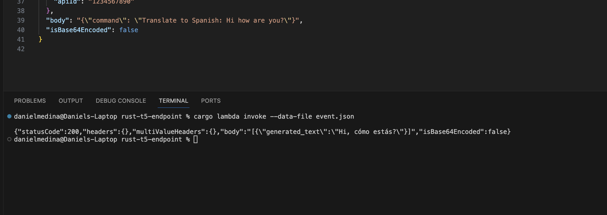
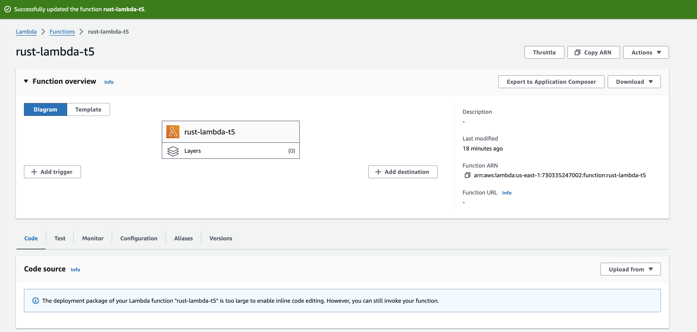
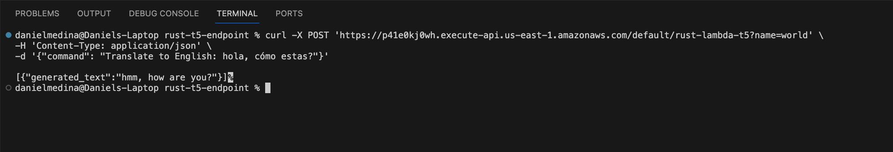

# Rust AWS Lambda T5 Endpoint

This document outlines the development, Dockerization, deployment, and operational details of a Rust-based AWS Lambda function T5 endpoint. The function is designed to interact with the T5 transformer model and is accessible via an API Gateway HTTP trigger.

## Dockerization of the Lambda Function

### Overview
The Rust function was containerized using Docker to ensure a consistent runtime environment compatible with AWS Lambda.

### Steps
1. **Dockerfile Creation**: A Dockerfile was created to define the environment setup, Rust code compilation, and output binary configuration.
2. **Building the Image**: The Docker image is built using `docker build -t rust-lambda-t5 .`.
3. **Creating the Container**: The container is based on the Amazon Linux 2 environment to match Lambda's execution environment.



## Function Logic

### Description
The Lambda function processes incoming HTTP requests, invokes a transformer model with the extracted data, and returns the model's response.

## Serverless Deployment with AWS Lambda

### Configuration
The function is deployed to AWS Lambda, using an IAM role with permissions to access necessary AWS services.

### Deployment Process
1. **Package the Function**: The function is packaged into a zip file, including the compiled binary renamed to `bootstrap`.
2. **Upload to AWS Lambda**: The package is uploaded to AWS Lambda via the AWS Management Console.
3. **Set Environment Variables**: Required for specifying runtime behavior and external dependencies.



## Endpoint Functionality

### API Gateway Trigger
AWS API Gateway is configured to trigger the Lambda function via HTTP requests, providing a scalable and secure entry point.

### Endpoint Details
- **API Type**: HTTP
- **Method**: ANY
- **Resource Path**: `/rust-lambda-t5`
- **Authorization**: NONE, allowing public access
- **Usage Example**: The function can be invoked using a simple curl command:
   ```bash
   curl -X POST 'https://p41e0kj0wh.execute-api.us-east-1.amazonaws.com/default/rust-lambda-t5?name=world' \
   -H 'Content-Type: application/json' \
   -d '{"command": <YOUR_PROMPT_HERE>}'


